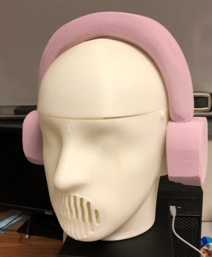

# Talking Heads

Acoustic head simulators that:
- Record spatial audio with realistic spatial cues
- Can "talk" using loudspeakers
- Can be reliably moved, tilted, or otherwise manipulated
- Are cheaply and quickly produced

### Designs
| Iteration | Image | Link |
| --- | --- | --- |
| v3 |  | [Link](./models/v3) |
| v2 |  | [Link](./models/v2) |
| v1 |  | [Link](./models/v1) |
| v0 |  | - |