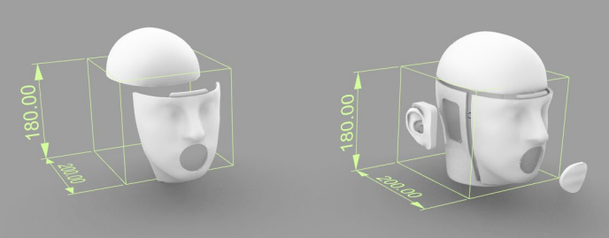
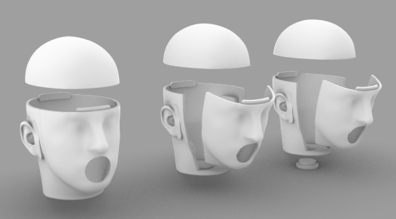
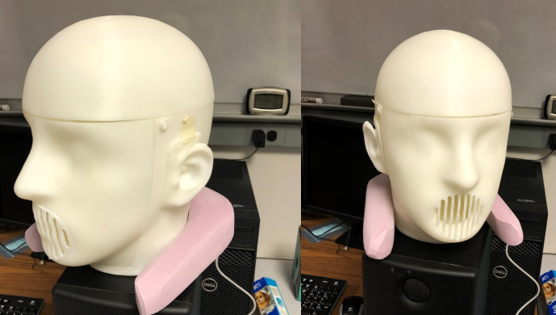
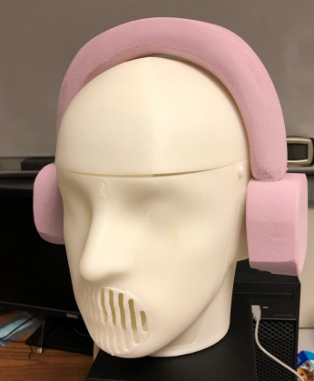
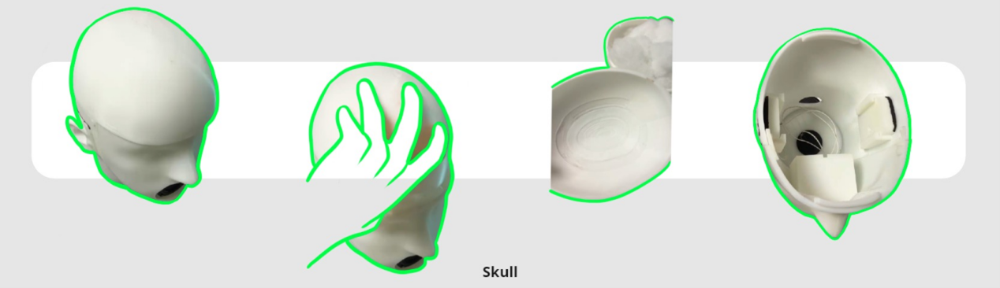
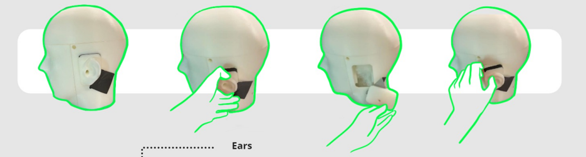
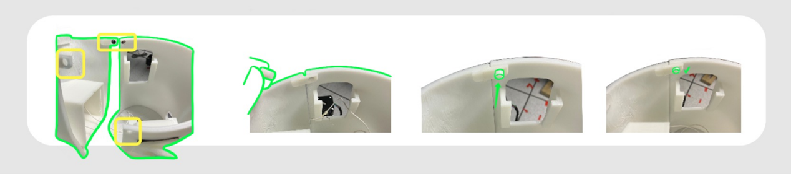

## Talking Head (v1)
Based on previous projects with machined components. The goal is to reduce production time.


<br/>

<br/>
<i>Renders from <a href="#Citations">[Tang21]</a></i>
<br/>



<br/>
<i>Photos from <a href="#Citations">[Tang21]</a></i>
<br/>


<br/>

<br/>

<br/>
<i>Figures from <a href="#Citations">[Yue22]</a></i>
<br/>

### Assembly-wide features
- Fully 3D printed
- Replaceable ear parts

### Per-part features
| Part(s) | Feature(s) | 3D print file(s) |
| --- | --- | --- |
| Ears | - Cavity for lavalier microphones <br/> - Realistic shape for binaural recordings | See v2 |
| Head | - Realistic proportions and ear-to-ear distance <br/> - Can be filled with acoustically absorptive material for increased realism <br/> - Channels for microphone cables | See v2 |
| Mouth | - Cavity for loudspeaker <br/> - Optional mouth cover/shield <br/> - Channels for loudspeaker cables  | See v2 |

### References
⚠ These are non-indexed course materials. Available upon request.
```bibtex
@misc{Tang21,
    author  = {Zhihao Tang},
    title   = {Report for TE 401},
    year    = {2021}
}
```
```bibtex
@misc{Yue22,
    author  = {Xinran Yue},
    title   = {Acoustic Head Simulator (TE 401 Final Report)},
    year    = {2022}
}
```