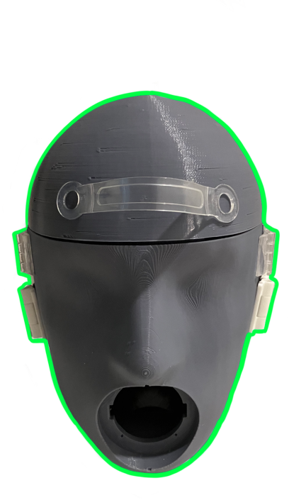
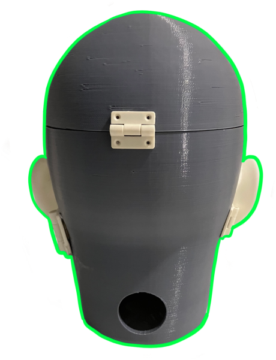
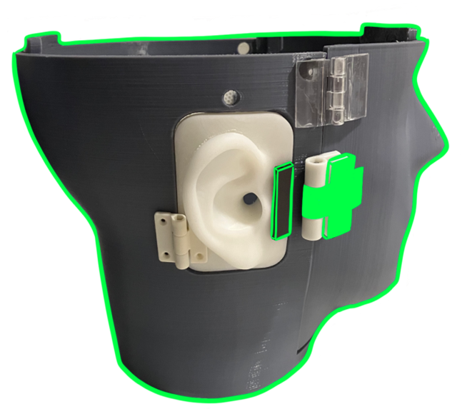

## Talking Head (v2)
Based on v1, the key motivations are increased robustness and usability.





### Assembly-wide features
- All but a few parts are 3D printed
- Smaller printed parts to fit bed sizes of common 3D printers
- Hinges and magnets to join parts together
- Overall greater stability for motion, tipping

### Per-part features
| Part(s) | Feature(s) | 3D print file(s) |
| --- | --- | --- |
| Ears | - Cavity for lavalier microphones <br/> - Realistic shape for binaural recordings | [left](./solids/EarLeft.stl), [right](./solids/EarRight.stl) |
| Head | - Realistic proportions and ear-to-ear distance <br/> - Can be filled with acoustically absorptive material for increased realism <br/> - Channels for microphone cables | [head](./solids/HeadBase.stl), [face](./solids/Face.stl), [cranium](./solids/HeadScalp.stl) |
| Mouth | - Cavity for loudspeaker <br/> - Optional mouth cover/shield <br/> - Channels for loudspeaker cables  | [box](./solids/MouthBox.stl), [cover](./solids/MouthCover.stl) |

### References
⚠ These are non-indexed course materials. Available upon request.
```bibtex
@misc{Yue22,
    author  = {Xinran Yue},
    title   = {Acoustic Head Simulator (TE 401 Final Report)},
    year    = {2022}
}
```