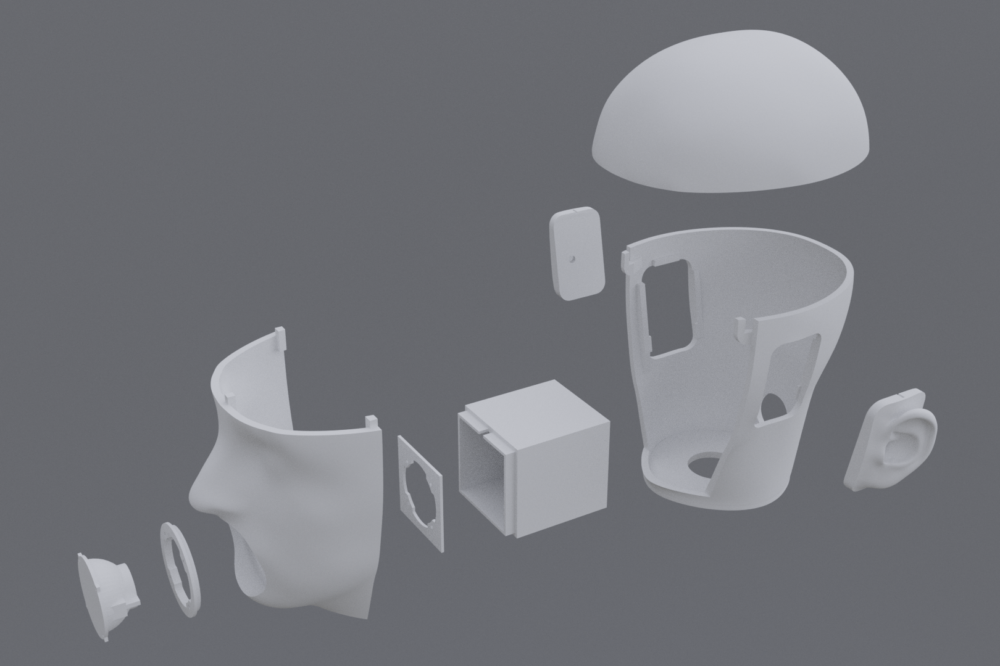

## Talking Head (v3)

Based on v1 and v2, the motivation is improved robustness without non-printed parts.



### Assembly-wide features
- No critical non-printed parts
- Smaller pieces are now all optional, cheap fastener screws
- Fewer printed parts overall
- Designed to be fully printable with a 1kg spool

### Per-part features
| Part(s) | Feature(s) | 3D print file(s) |
| --- | --- | --- |
| Ears | - Cavity for lavalier microphones <br/> - Realistic shape for binaural recordings | [left](./solids/ear_left.stl), [right](./solids/ear_right.stl) |
| Head | - Realistic proportions and ear-to-ear distance <br/> - Can be filled with acoustically absorptive material for increased realism <br/> - Channels for microphone cables <br/> - Fastener channels to enable tightening set screws| [head](./solids/main_base.stl), [face](./solids/main_face.stl), [scalp](./solids/main_scalp.stl) |
| Mouth | - Cavity for loudspeaker <br/> - Custom loudspeaker mount <br/> - Channels for loudspeaker cables  | [box](./solids/speaker_box.stl), [outer mount](./solids/speaker_mount_front.stl), [inner mount](./solids/speaker_mount_back.stl) |


### References
Note: do not cite, these reports are not indexed.
```bibtex
@misc{Lu23,
    author  = {Austin Lu},
    title   = {3D Printed Head Simulators (V3)},
    year    = {2023}
}
```

```bibtex
@misc{Yue22,
    author  = {Xinran Yue},
    title   = {Acoustic Head Simulator (TE 401 Final Report)},
    year    = {2022}
}
```